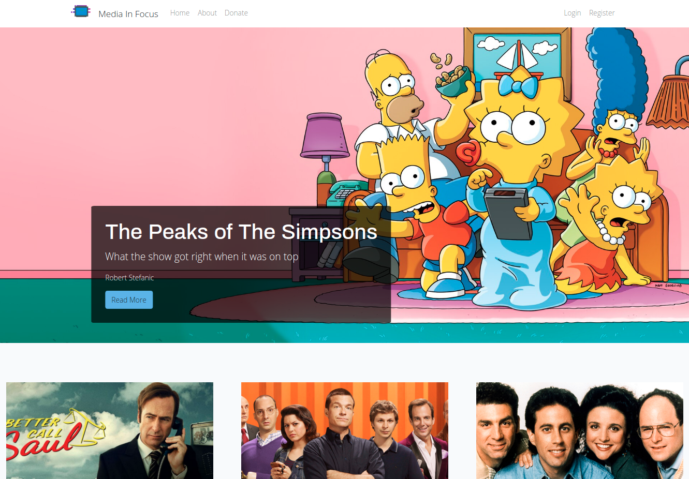
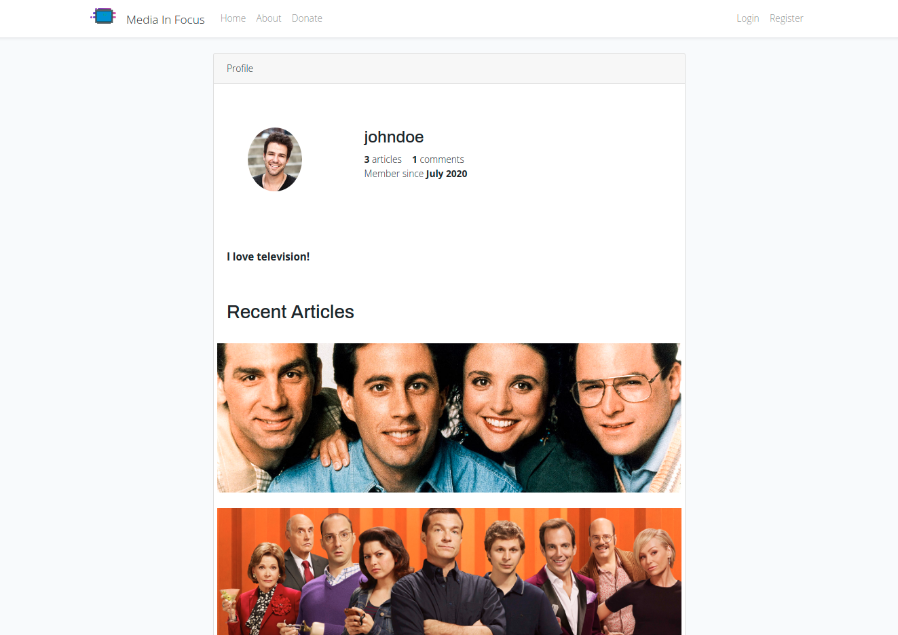
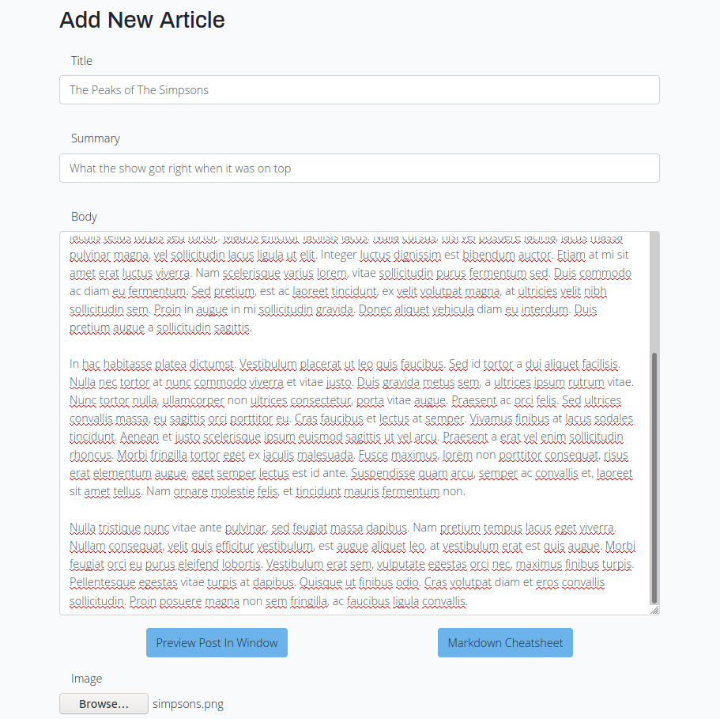
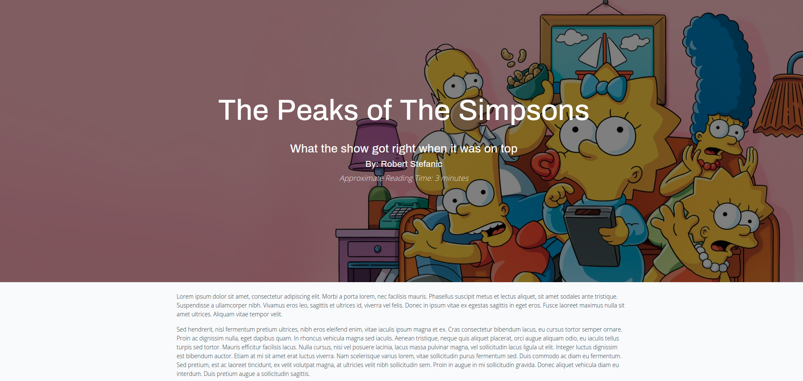
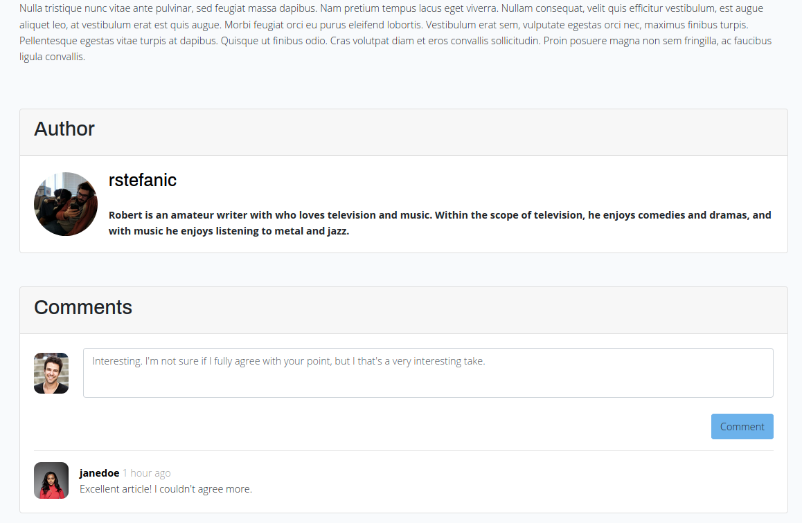

<h1 align="center">Media Blog</h1>

<h2 align="center">A concept for a multi-author blogging site for writing about modern media written using Laravel and Vue.js.</h2>

<p align="center"></p>

## Features

The site features multiple users level accounts including users (who can post comments), authors (who can post comments, publish articles, and moderate the comments section on their published articles), and administrators (who can post comments, publish articles, moderate all of the comments site wide, and add/edit/delete any article).

<p align="center"></p>
<p align="center"><em>Users can customize their profile for others to look at. The profiles include the user's articles (if they're an author) and their recent comments.</em></p>
<br>
<br>

<p align="center"></p>
<p align="center"><em>Authors can create their posts using Markdown and preview their posts before publishing it.</em></p>
<br>
<br>

<p align="center"></p>
<p align="center"><em>Articles then appear on their own page with a unique slug.</em></p>
<br>
<br>

<p align="center"></p>
<p align="center"><em>The comments section for the articles are found at the bottom of the articles page.</em></p>
<br>
<br>

# Installation

This site runs using:

-   PHP 7.4
-   Laravel
-   MySQL/MariaDB
-   Vue.js
-   Some webserver such as Apache

Developer dependencies include: 
-   Composer
-   node.js
-   npm

## PHP 7.4

This site uses PHP 7.4. The details on how to install PHP 7.4 will differ based on your system. In addition to installing PHP 7.4, you will also need the following PHP extensions:

-   BCMath PHP Extension
-   Ctype PHP Extension
-   JSON PHP Extension
-   Mbstring PHP Extension
-   OpenSSL PHP Extension
-   PDO PHP Extension
-   Tokenizer PHP Extension
-   XML PHP Extension

If you're running a MacOS system, then just by running `brew upgrade` you should have the package repository available.

If you're running a GNU/Linux system, then you'll have to add the package repository `ppa:ondrej/php` in order to download PHP 7.4. Additionaly, if you're using Apache as your web server, you should also add `ppa:ondrej/apache2` and install `php7.4-fpm`.

If you're running a Windows machine, then the binaries on the offical PHP website should contain all of the extensions listed above by default.

## Composer

Once you have PHP 7.4 installed, you can run the following command in your terminal to install composer. You can also go to the [Composer](https://getcomposer.org/download/) website and follow the instructions there. Alternatively, there is a composer installation script that you can use to install composer if you're working with UNIX utilities.

```shell
php -r "copy('https://getcomposer.org/installer', 'composer-setup.php');"
php -r "if (hash_file('sha384', 'composer-setup.php') === 'c5b9b6d368201a9db6f74e2611495f369991b72d9c8cbd3ffbc63edff210eb73d46ffbfce88669ad33695ef77dc76976') { echo 'Installer verified'; } else { echo 'Installer corrupt'; unlink('composer-setup.php'); } echo PHP_EOL;"
php composer-setup.php
php -r "unlink('composer-setup.php');"
```

Once you have composer installed, you'll have to double check and make sure that composer is installed globally.

-   macOS: `$HOME/.composer/vendor/bin`
-   Windows: `%USERPROFILE%\AppData\Roaming\Composer\vendor\bin`
-   GNU / Linux Distributions: `$HOME/.config/composer/vendor/bin or $HOME/.composer/vendor/bin`

_NOTE:_ If the above installation does not install composer globally for you on a MacOS system, you can install it with `brew install composer`.

## Installing MySQL

Start by installing MySQL or MariaDB (either one will work). By default, the `.env` file is configured to use MySQL (more on this in a moment), so you will not need to make any changes there.

I'll quickly walk through a GNU/Linux installation of MySQL on a Debian based system. Run the following to install MySQL.

```shell
sudo apt-get install mysql-server
```

Then run `sudo mysql_secure_installation utility` to setup the database.

Login to MySQL:

```shell
mysql -u root
```

If you have insufficent permission errors when you're trying to log into MySQL as root, you may need to set the root login to use mysql_native_password instead of auth_socket. To achieve this, you will first run the above command with `sudo`, and then once you're in MySQL, run the following commands to set the root login.

```sql
USE mysql;
UPDATE user SET plugin='mysql_native_password' WHERE User='root';
FLUSH PRIVILEGES;
```

Once you're in logged into MySQL as root, create the mediablog database.

```sql
create database mediablog;
```

## Configuring your .env file

The `.env` file contains the program's environment information. Copy the `.env.example` file from the root of the project and name it `.env`.

```shell
cp .env.example .env
```

Now edit the `.env` file and change the value of `APP_NAME` to 'MediaBlog'.

If you have any special URLS that you'd like to use that you've pre-configured in your host file, you can also change the value of `APP_URL` here.

Finally, change the value of `DB_DATABASE` to 'mediablog'. Everything else should be using the defaults specified.

## Install Node.js

Just as the installation for PHP differed from system to system, so will your installation of node.js. Luckily, there is nothing to install here beyond Node.js and there are plenty of step by step guides on how to install node.js.

## Install npm

Just as we installed a package manager for PHP, we also need a package manager for JavaScript. Once again, the installation for npm will vary from system to system.

## Installing the project

Great! At this point, everything's in place to install the project. Make sure you're in the root directory of the project before running these commands.

The first thing we'll do here is install and configure our PHP packages using composer.

```shell
composer install
```

Next, we'll migrate the database using artisan.

```shell
php artisan migrate
```

Finally, we're going to install all of our JavaScript dependencies.

```shell
npm install
```

Generate the app key.

```shell
php artisan key:generate
```

And finally, genreate a system link for the storage folder.

```shell
php artisan storage:link
```

Once that's all done, we can run `php artisan serve` to run a development server, and then navigate to `https://localhost:8000` (or the custom URL that you entered in earlier in your `.env` file).

And viola! You're all set up and running the MediaBlog site for development.